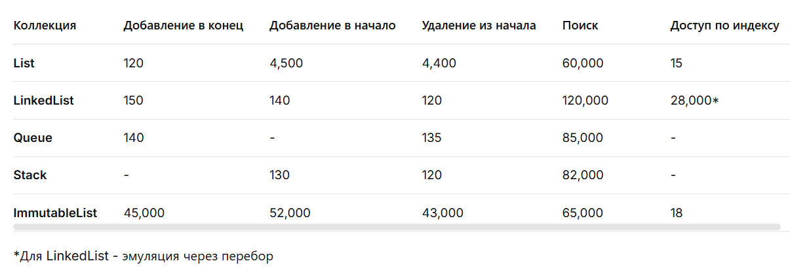

# ОТЧЕТ ПО ЛАБОРАТОРНОЙ РАБОТЕ

1. Подход к реализации замеров
Использован Stopwatch для измерения времени

Каждая коллекция содержит 100 000 элементов

Каждая операция выполняется 5 раз, результаты усредняются

Тестируются все операции (добавление, удаление, поиск)

Результаты сохраняются в тиках

2. Результаты замеров

3. Анализ преимуществ и недостатков
List<T>
+ Быстрый доступ по индексу (O(1))
+ Быстрое добавление в конец
- Медленное добавление/удаление в начало (O(n))
- Медленный поиск (O(n))

LinkedList<T>
+ Быстрое добавление/удаление в начало/конец (O(1))
- Очень медленный доступ по индексу (O(n))
- Медленный поиск (O(n))

Queue<T>
+ Оптимизирован для Enqueue/Dequeue (O(1))
- Только FIFO операции
- Нет доступа по индексу

Stack<T>
+ Оптимизирован для Push/Pop (O(1))
- Только LIFO операции
- Нет доступа по индексу

ImmutableList<T>
+ Потокобезопасность
+ Быстрый доступ по индексу
- Очень медленные операции модификации

4. Рекомендации
List<T> - лучший выбор для большинства случаев. Queue/Stack - для специальных задач. LinkedList особо и не нужен...